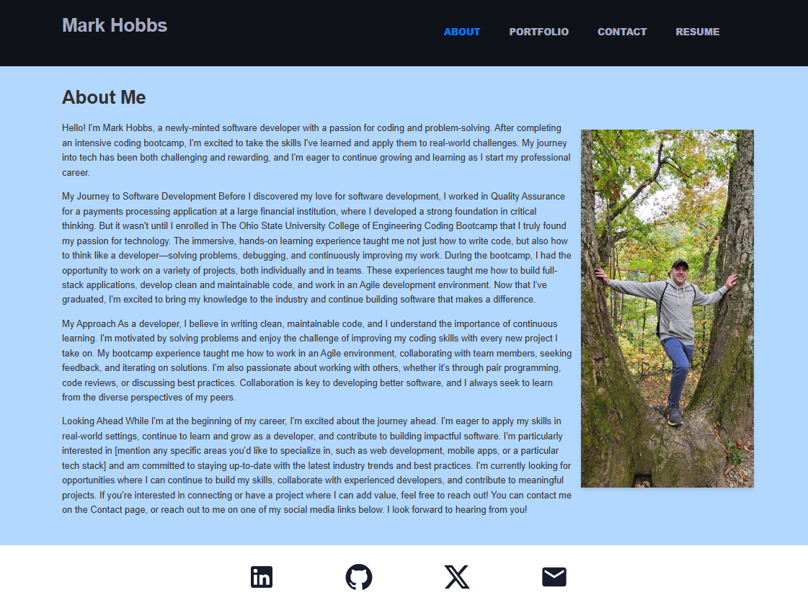

# README Generator  
  ## License [](https://opensource.org/licenses/MIT)  https://opensource.org/licenses/MIT  
    This project is licensed under the MIT license. 
    Click the badge for more information.  
  ## Description  
  This application is a Portfolio that was built with React.js and TypeScript. It is a single-page application that showcases my projects, skills, and contact information. The application is responsive and can be viewed on any device.

  The application is divided into four main sections:
  1. About Me: This section contains a brief introduction about me and my background.
  2. Portfolio: This section contains a list of my projects. Each project is displayed as a card with a title, description, and links to the GitHub repository and the deployed application.
  3. Contact: This section contains a form that can be used to send me a message. The form contains fields for the user's name, email address, and message. The form also contains a submit button that sends the message to my email address.
  4. Resume: This section contains a link to my resume. The resume is a PDF file that can be downloaded by clicking the link.


  ## Table of Contents  
  - [Description](#description)  
  - [Installation](#installation)  
  - [Usage](#usage)  
  - [License](#license)  
  - [Contribution](#contribution)  
  - [Tests](#tests)  
  - [Questions](#questions)  
  ## Installation  
  To install this project:  

  1. Clone the repo
   ```sh
    git@github.com:hobbsm-code/react-portfolio.git
   ```
  2. Install NPM packages (from the root directory)
   ```sh
   npm run install
   ```

  ## Usage  
  Please follow these instructions to use the Weather Dashboard application:

  1. Open a terminal and cd into the Develop directory
  2. Type npm run start:dev to run the application in development mode or npm run start to run the application in production mode
  3. The application will open in your default browser and you will see the About Me section of the Portfolio

  <div align="center">
  
  </div>
  
  ## Contribution  
  Contributions are what make the open source community such an amazing place to learn, inspire, and create. Any contributions you make are **greatly appreciated**.

  If you have a suggestion that would make this better, please fork the repo and create a pull request. You can also simply open an issue with the tag "enhancement".
  Don't forget to give the project a star! Thanks again!

  1. Fork the Project
  2. Create your Feature Branch (`git checkout -b feature/AmazingFeature`)
  3. Commit your Changes (`git commit -m 'Add some AmazingFeature'`)
  4. Push to the Branch (`git push origin feature/AmazingFeature`)
  5. Open a Pull Request

  ## Tests  
  Test instructions:  

  This project does not currently have any unit tests. Having test coverage is always welcome. Please feel free to contribute some unit tests. Otherwise, it is our goal to improve the test coverage as the project becomes more mature and more complex functionality is added.

  ## Questions  
  For questions, please contact me at:  
  GitHub: [Find me on GitHub ->  hobbsm-code](https://github.com/Find me on GitHub ->  hobbsm-code)  
  Email: [Email me at: hobbsm321@gmail.com]  
  